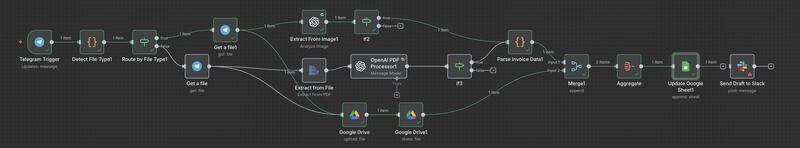
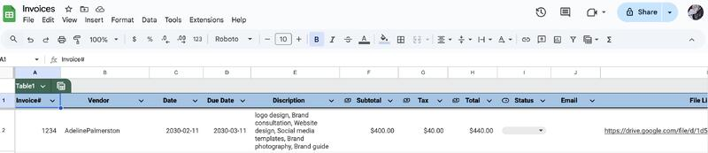
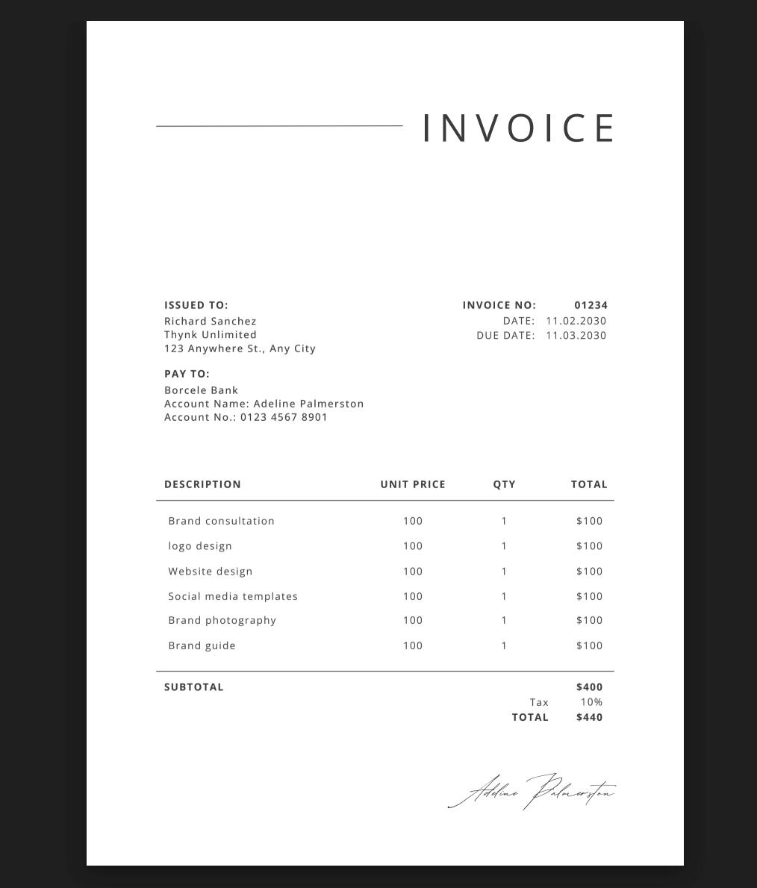

# Automating Bookkeeping with AI and n8n

I built an AI Automated Bookkeeping System using n8n, OpenAI, Telegram, and Google Drive/Sheets to automatically sort invoices, extracting details, and updating spreadsheets.

### Features:
1. **Telegram Upload:** send an invoice (PDF or image) to a Telegram bot I created\
\
2. **File Detection & Extraction:** n8n detects the file type, extracts text using built-in PDF/image processing\
\
3. **AI Processing (OpenAI GPT-4o):** the extracted text is passed to OpenAI, which parses key accounting data like invoice number, vendor name, invoice date & due date, description of services, subtotal, tax, total, and payment status\
\
4. **Data Parsing & Formatting:** A JavaScript node cleans and structures the AI output into JSON format\
\
5. **Cloud Storage & Record Keeping:** The invoice is automatically uploaded to Google Drive, shared publicly, and its link is saved\
\
6. **Google Sheets Update:** the extracted information and the invoice file link are appended to a live Google Sheet database automatically

### What It Solves:
1. Eliminates manual data entry
2. Saves hours of repetitive bookkeeping
3. Centralizes invoice records with attached files
4. Reduces human error in financial data logging
5. Enables real-time expense tracking

### Media

This is a workflow of the n8n automation.\
\

This is a screenshot of the Google Sheets database that is automatically updated.\
\

This is an example of an invoice that was sent to the Telegram bot and processed by the automation