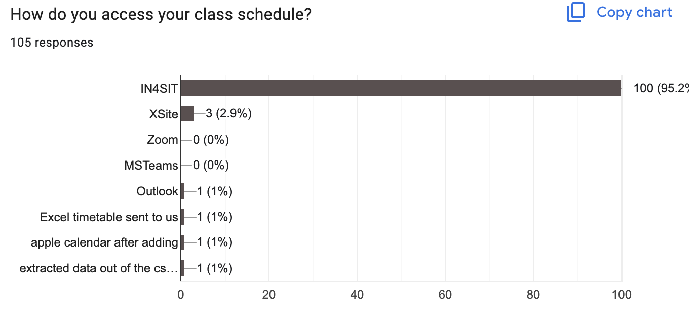
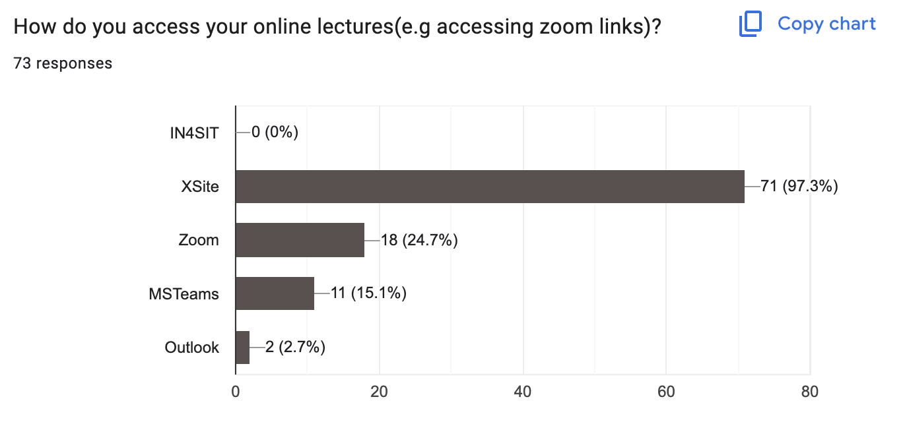

# Student project: Data Visualisation with how students access their learning materials

During my trimester 1 in SIT, I had a project where I had to gather data on how student access their current learning materials to understand their preferences and improve the efficiency of educational content.\

## Total number of data collected
105 students currently studying in SIT

## Accessing class schedule
| Category        | Amount ($) |
|-----------------|------------|
| IN4SIT          | 100        |
| XSite           | 3          |
| Outlook         | 1          |
| Others          | 3          |
\

## Accessing online lectures
| Category        | Amount ($) |
|-----------------|------------|
| IN4SIT          | 0          |
| XSite           | 71         |
| Zoom            | 18         |
| MSTeams         | 11         |
| Outlook         | 2          |
\
